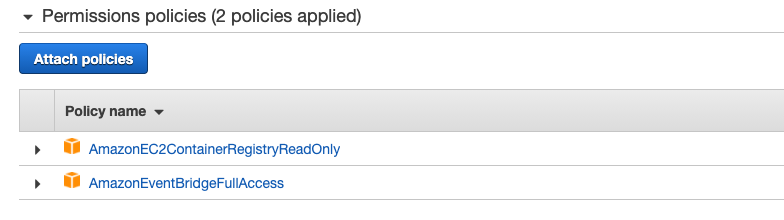
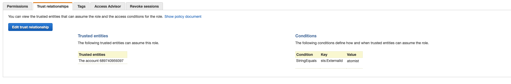
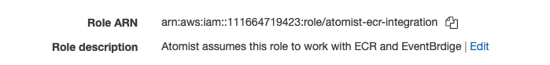

## Providing access to ECR without exchanging AWS credentials

### Step 1

We provide two non-secret values to any customer that wants to use our
integration.

-   an account-id
    -   We don't care that people know about this account (not the account we
        use for our infra). For example, I'm testing with an account
        (`689740959397`) that just has one user.
    -   the creds for this account's user are private to Atomist. They are only
        used to run STS `AssumeRole` operations to get temporary creds for any
        teams that grant atomist access to their resources.
-   a customer workspace unique `external-id`
    -   any guid is fine here
    -   these are to prevent a confused deputy attack. They do not need to be
        kept secret. They just need to be unique for each customer.

Neither of these two pieces of information need to be kept private. They can be
displayed on our integration page in dso.

### Step 2

Customer uses the `account-id` and `external-id` above to create a new trusted
role.

-   role can have any name (e.g. `atomist-ecr-integration`).
-   should at least attach policy `AmazonEC2ContainerRegistryRead`. Looks like
    they could also give us the ability to setup EventBridge automatically.

The role creation dialogs help set up the trust but the "trust relationships"
will look like this:

### Step 3

Customer gives Atomist the new role `arn` as an ecr integration parameter.
Atomist can now verify that we can assume that role, and begin querying for
details about their Docker registry.

The `arn` is not really private information but we should still take it as
`secret` string.

## Example

-   Customer uses `689740959397` and `guid` to create a "trusted" role named
    `atomist-ecr-integration` with attached policy
    `AmazonEC2ContainerRegistryReadOnly`. This operation produces a role `arn`
    with the value "arn:aws:iam::123457890123:role/atomist-ecr-integration".
-   Customer enters "arn:aws:iam::123457890123:role/atomist-ecr-integration"
    into their workspace ecr-integration
-   Atomist verifies that we can access ECR.

No creds are exchanged.

[third-party-roles]:
    https://docs.aws.amazon.com/IAM/latest/UserGuide/id_roles_common-scenarios_third-party.html
[tutorial]:
    https://docs.aws.amazon.com/IAM/latest/UserGuide/tutorial_cross-account-with-roles.html
[confused-deputy]:
    https://research.nccgroup.com/2019/12/18/demystifying-aws-assumerole-and-stsexternalid/
